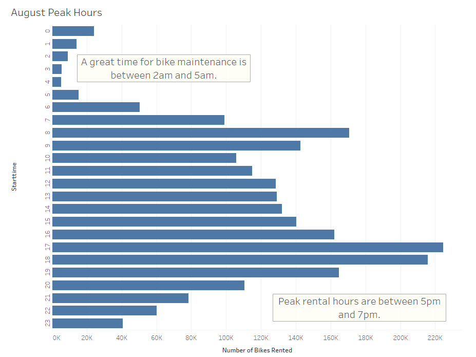
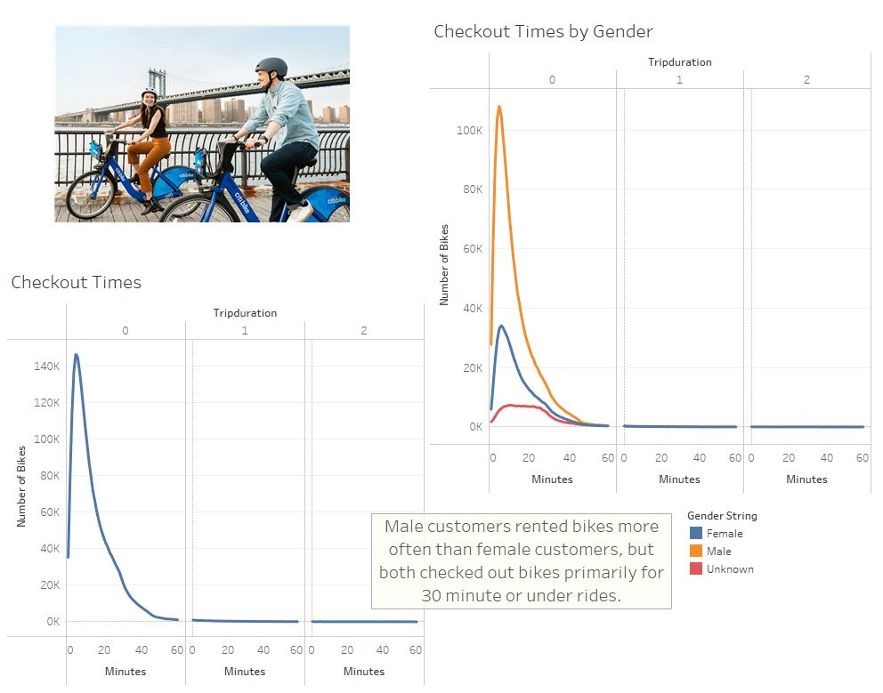
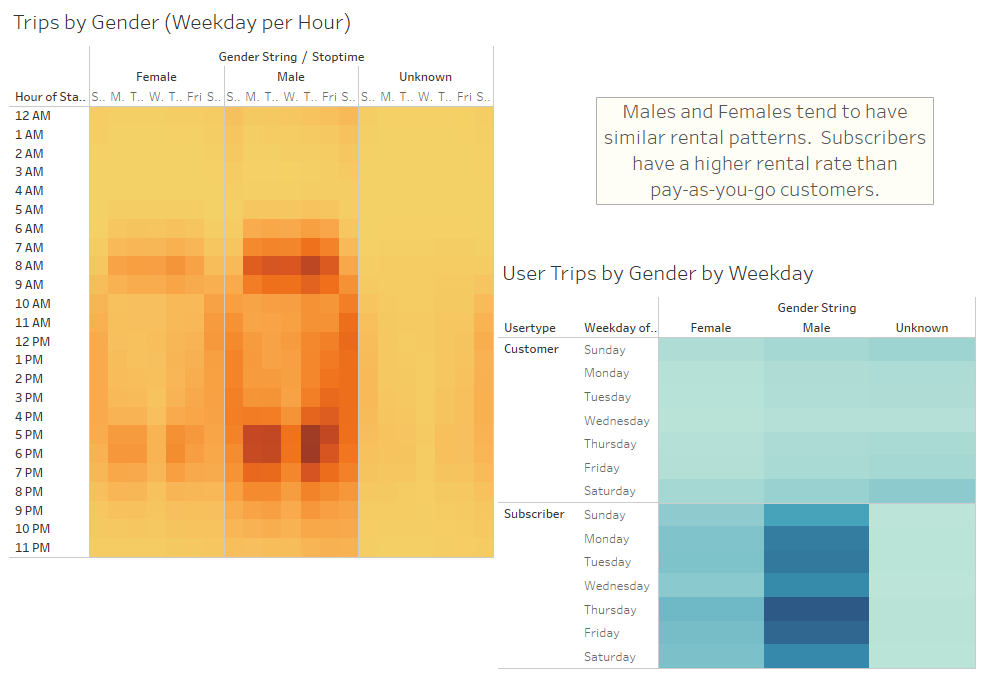
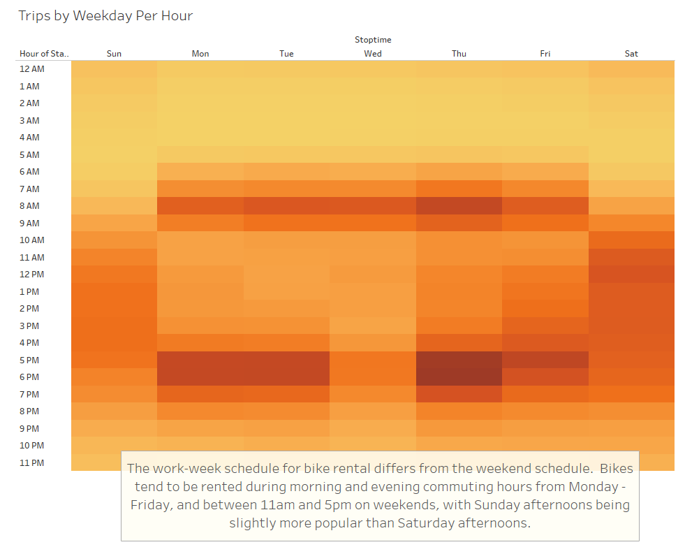
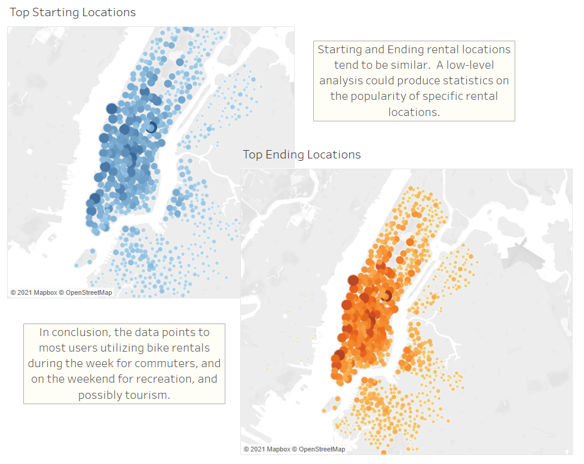

# Bikesharing
[CitiBike Tableau Dashboard](https://public.tableau.com/views/CitiBikeDashboard_16308776925340/NYCCitiBikeStory?:language=en-US&publish=yes&:display_count=n&:origin=viz_share_link "CitiBike Tableau Dashboard")
## Overview
The purpose of this project was to analyze the usage of the CitiBike rental program in NYC for the month of August.  The data has been analyzed and a tableau story created for the purpose of presentint to investors to extend the program to Des Moines, Iowa.

## Resources
- Tableau Public 2021.2
- 201908-citibike-tripdata.csv

## Results
The first visualization I included in my Tableau story was the August peak hours:

This image shows the frequency with which customers rent bicycles by hour of the day.  The data shows that early morning hours would be a great time for bicycle maintenance, and that peak rental hours are early evening 5pm to 7pm.

This visualization from my Tableau story shows that the majority of customers rented bikes for 10-30 minute time intervals.  There were very few one hours plus rentals.

While there are more male than female customers, they tend to have similar rental patterns.  Subscribers rent more bikes than pay-as-you-go customers.

Weekday rental hours differ from weekend hours.  Monday through Friday peak hours generally correspond to traditional commuter hours. Weekend hours tend to start later (11am) but remain steady until about 7pm. 

Starting and ending locations tend to be similar in NYC, primarily around lower Manhattan.

## Summary
Based on the data, I would recommend pushing subscriber customers primarily.  Perhaps an incentive could be offered for pay-as-you-go customers to put their cost toward a subscription.  In addition, bikes are most often utilized at peak commuting times.  I would recommend making sure that bike rental stations are located in downtown areas near office buildings, and also at nearby residential areas where commuters live.

Based on the rental pattern data, I would suggest that bicycle maintenance be complete by 5am on Monday - Friday, but could be done later on weekends, if necessary.  

## Recommendations
I would recommend an analysis on individual rental locations.  In NYC, there may be more commuter customers than in Des Moines, Iowa.  It would be interesting to compare the number of residents who own vehicles, or are fulltime public transportation users in the two cities.  A campaign to bring CitiBike to Des Moines may need to include rental locations in popular tourist areas, parks and recreational locations.

I would also recommend an additional analysis of bike rental utilization by age group and location.  The demographic in Des Moines, Iowa may differ from NYC, and therefore it would be useful to see what the demographic of different areas of Des Moines is, and compare that to the same demographic sample in NYC to better plan locations of bike rental stations.

